<p align="center">
  <picture>
    <source media="(prefers-color-scheme: dark)" srcset="docs/assets/logo-dark.svg">
    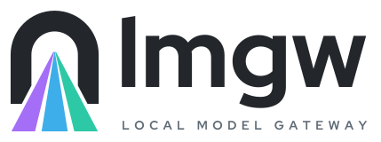
  </picture>
</p>

<p align="center">
  Your own GPU behind OpenAI- and Anthropic-compatible APIs, with the cloud one alias away.
</p>

<p align="center">
  <a href="https://github.com/lmgw-dev/lmgw/releases/latest"></a>
  <a href="https://github.com/lmgw-dev/lmgw/actions/workflows/ci.yml"></a>
  <a href="LICENSE.md"></a>
  
  
</p>

lmgw, short for local model gateway, is a Linux desktop app. It runs models on
your own GPU and serves them through local copies of the OpenAI and Anthropic
APIs, so tools and SDKs built for those services only need a new base URL. The
models live in Podman containers. llama.cpp handles text, while speech and
images go to audio.cpp and stable-diffusion.cpp, and each container starts
when a request needs it and shares the card under VRAM-aware scheduling. Cloud
providers (OpenAI-compatible, Anthropic, Gemini) plug in behind the same
aliases. Moving an alias from a local model to a cloud one goes unnoticed by
the client, and while the GPU is on hold, requests can fall back to the cloud.
It all runs from the system tray. The dashboard opens in its own window and
works remotely from a browser too.

## Screenshots

<table>
  <tr>
    <td align="center" width="50%">
      <a href="docs/screenshots/overview.png">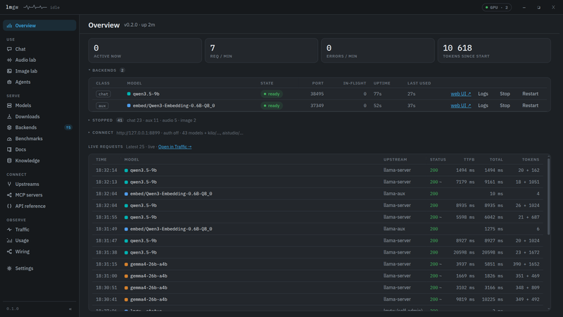</a><br>
      <sub><b>Overview</b> · running models and live requests</sub>
    </td>
    <td align="center" width="50%">
      <a href="docs/screenshots/chat.png">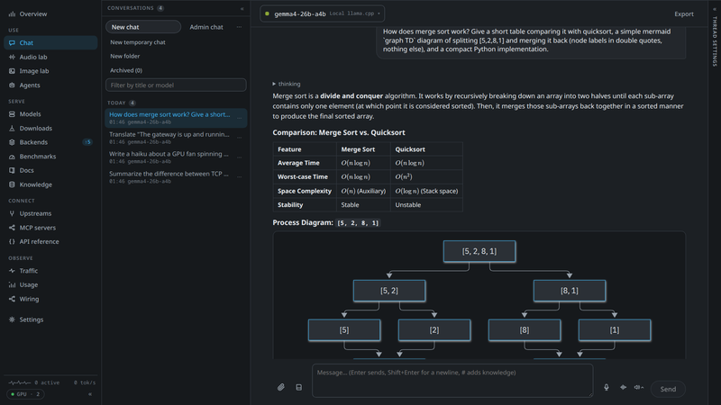</a><br>
      <sub><b>Chat</b> · any alias, with Markdown, math and Mermaid</sub>
    </td>
  </tr>
  <tr>
    <td align="center">
      <a href="docs/screenshots/models.png">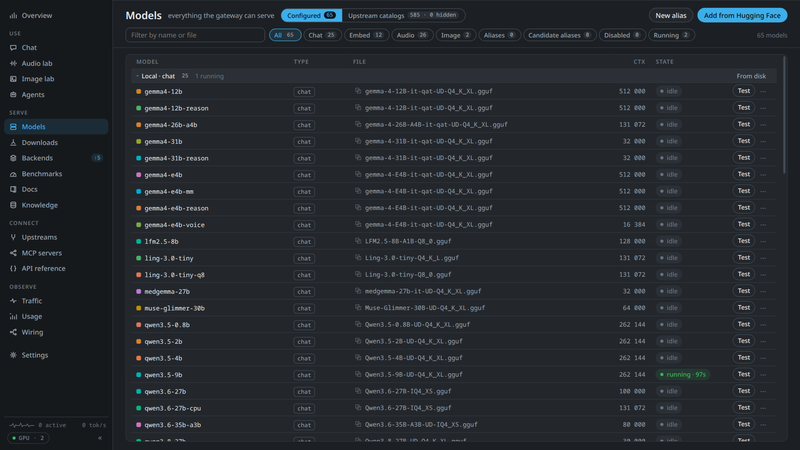</a><br>
      <sub><b>Models</b> · local models, aliases and upstream catalogs</sub>
    </td>
    <td align="center">
      <a href="docs/screenshots/usage.png">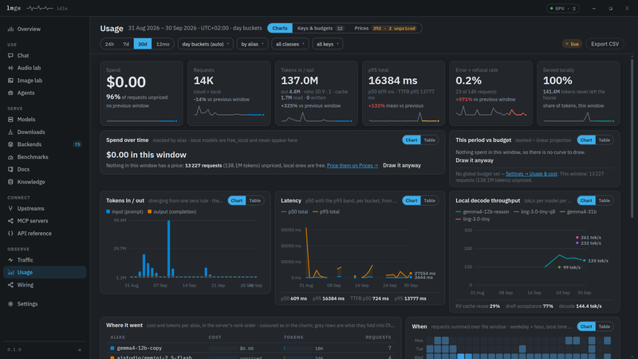</a><br>
      <sub><b>Usage</b> · tokens, latency, throughput and cost</sub>
    </td>
  </tr>
  <tr>
    <td align="center">
      <a href="docs/screenshots/traffic.png">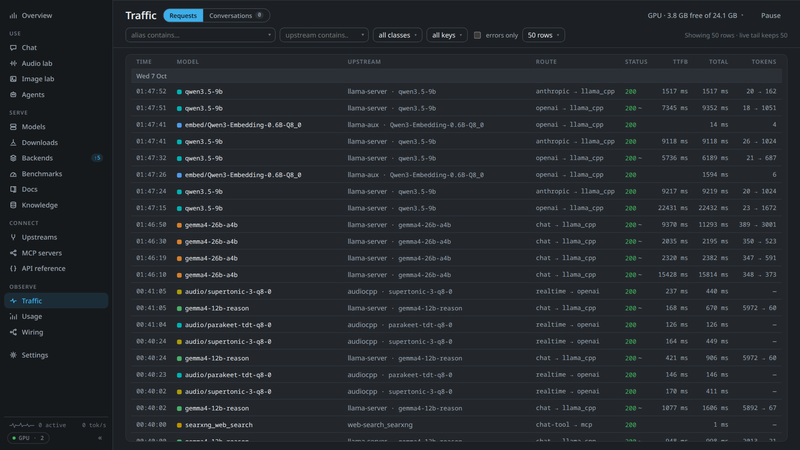</a><br>
      <sub><b>Traffic</b> · every request, across both API dialects</sub>
    </td>
    <td align="center">
      <a href="docs/screenshots/backends.png">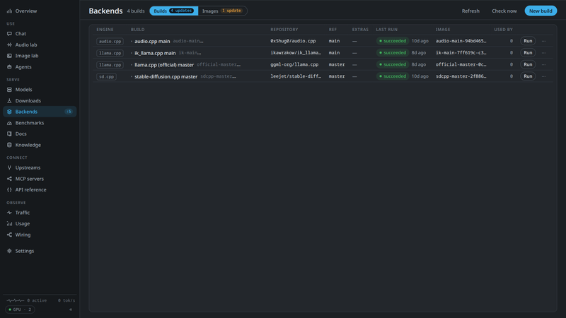</a><br>
      <sub><b>Backends</b> · engine images built from git</sub>
    </td>
  </tr>
  <tr>
    <td align="center">
      <a href="docs/screenshots/mcp-servers.png">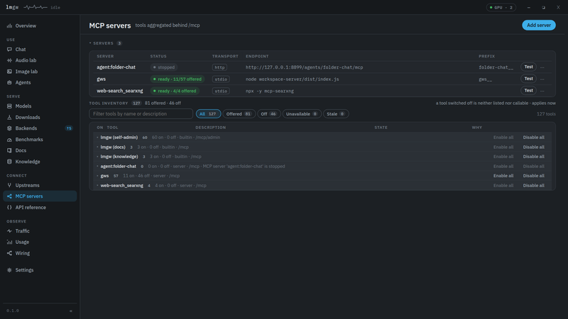</a><br>
      <sub><b>MCP servers</b> · one <code>/mcp</code> endpoint for all tools</sub>
    </td>
    <td align="center">
      <a href="docs/screenshots/api-reference.png">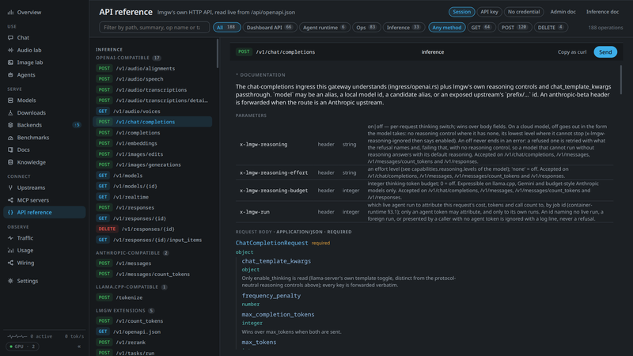</a><br>
      <sub><b>API reference</b> · live OpenAPI docs with a request tester</sub>
    </td>
  </tr>
</table>

<sub>The app window at 1920×1080, a 1080p screen at 125% scaling. Click a thumbnail for the full image.</sub>

## Features

**Local models**
- **One container per model.** Chat, embedding and rerank models run on llama.cpp or ik_llama.cpp. audio.cpp covers TTS, ASR and a dozen other audio tasks, and stable-diffusion.cpp generates and edits images.
- **VRAM-aware scheduling.** Admission works from measured GPU memory (NVML, or amdgpu sysfs). A model that doesn't fit waits, or pushes out an idle one, and idle models hand their memory back.
- **From Hugging Face to a running model.** Download a GGUF together with its projector and draft model, and lmgw proposes llama.cpp settings from the file's metadata.
- **Engine builds and benchmarks.** Build engine images from any git ref with pull requests merged in. Benchmarks measure prefill, decode, VRAM and tokens per joule.

**API and routing**
- **Local OpenAI and Anthropic APIs on one port.** `/v1/chat/completions`, `/v1/responses`, `/v1/embeddings`, `/v1/rerank`, `/v1/messages` and more. A client in either dialect can reach any chat model.
- **Local or cloud behind one alias.** An alias points at a local model or at an OpenAI-compatible, Anthropic or Gemini upstream. Streaming, tool calls and reasoning get translated in both directions, so switching changes nothing for the client.
- **Model capabilities in `/v1/models`.** Context length, output limit, modalities and reasoning controls, per model.
- **Voice conversations.** `/v1/realtime` speaks OpenAI's Realtime protocol over a WebSocket and answers with a cascade of your own models: turn detection inside lmgw, speech to text, a chat model, text to speech. See [Voice conversations](#voice-conversations).
- **MCP gateway.** Stdio servers (Podman-isolated by default) and HTTP servers sit behind one `/mcp` endpoint, each under its own tool prefix. For upstreams without `/v1/responses`, lmgw runs that API itself, MCP tool calls included.

**Docs and knowledge**
- **Library docs for small models.** A small local model reasons well but hasn't memorised every API. lmgw ingests the documentation of the libraries you use, one corpus per library version, and serves it to any agent as the `docs__resolve` and `docs__query` MCP tools. Search fuses BM25 with embeddings and can rerank. A model picks the chunk boundaries and code copies the text, so every chunk is the original word for word. When an agent finds a library missing, it can ask for it with `docs__request`.
- **Knowledge bases for your own files.** Put PDFs, office documents and spreadsheets into named collections. lmgw extracts the text and embeds it with the model you choose, and scanned pages can go through a vision model for OCR. In Chat, answers cite numbered excerpts that open the passage in its file. Agents can search the same bases through the `kb__*` tools on `/mcp`.

**Operations**
- **Usage and cost.** Every request is logged with its tokens, latency and price. Charts break it down by alias and key.
- **API keys with policy.** A key can carry alias and tool scopes, a budget, rate limits and a concurrency cap.
- **GPU hold.** A tray switch pauses local models while you need the card for something else. Requests can fall back to a cloud alias, and the `x-lmgw-fallback` header names the one that answered. An audio model switched to the CPU (its row's "Runs on") takes no VRAM and keeps serving through the hold.

**Dashboard and extensions**
- **Desktop app, remote-ready.** The tray menu covers the GPU hold, starting and stopping models, and updates, and the dashboard opens in a native window. Bind lmgw to your LAN and the same dashboard works remotely in any browser.
- **Rust from gateway to dashboard.** The dashboard is about 88,000 lines of Rust (Leptos), compiled to WebAssembly and built with cargo and Trunk. There's no npm anywhere in the tree. JavaScript is limited to vendored libraries for chat rendering (highlight.js, KaTeX, Mermaid, DOMPurify) and about 700 lines of glue for the window title bar and code blocks.
- **Chat, plus labs for audio and images.** Chat with any alias, with attachments, knowledge bases and MCP tools. Dictate into it, have replies read aloud, or talk with a conversation in voice mode, all on your own speech models (see [Voice in the Chat](#voice-in-the-chat)). The Audio lab and Image lab are playgrounds for the speech and image routes.
- **Self-administration over MCP.** The `lmgw__*` tools on `/mcp/admin` let an agent such as Claude Code inspect and configure the gateway. They stay off until you enable their key, and start out read-only.
- **Agents.** JSON manifests define chat presets, batch pipelines whose results you review before anything gets written, and container agents that bring their own UI.

## How it works

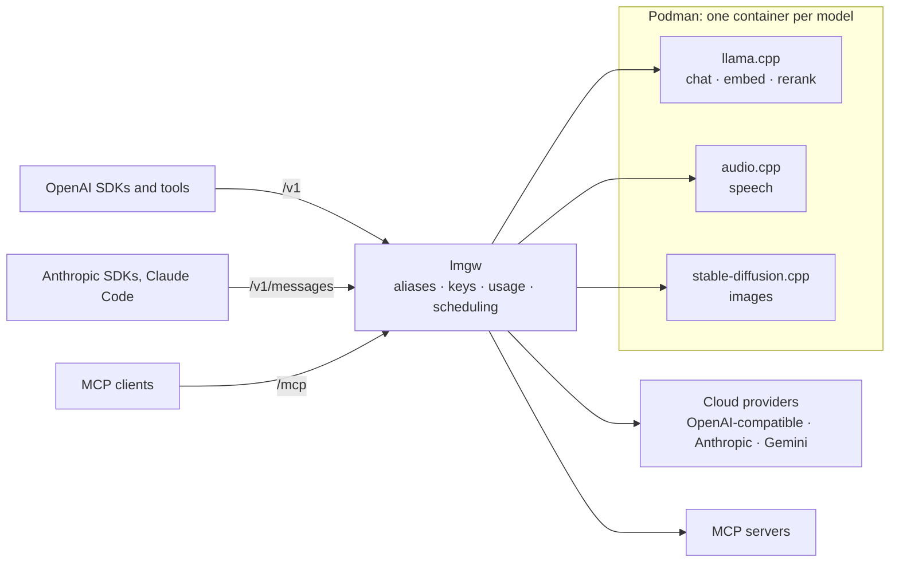

lmgw parses each request into one internal representation and routes it by
alias, and the target's adapter writes it out again in whatever protocol that
backend speaks. State lives in SQLite. Configuration, request logs and usage
go to `$XDG_DATA_HOME/lmgw`, usually `~/.local/share/lmgw`, unless
`LMGW_DATA_DIR` points elsewhere.

## Requirements

- **Linux, x86_64.** Developed and used daily on Fedora, and packaged as an RPM or an AppImage. There is no macOS or Windows build.
- **Podman** runs local models and stdio MCP servers, and the RPM depends on it. Cloud-only use needs no GPU.
- **NVIDIA GPU** is the tested path. Model containers get the card through `--device nvidia.com/gpu=all --security-opt label=disable` (the default in **Settings → Runtimes**), so you need the driver plus the NVIDIA Container Toolkit. Generate its CDI spec once:
  ```sh
  sudo nvidia-ctk cdi generate --output=/etc/cdi/nvidia.yaml
  ```
- **AMD** works on a Ryzen APU with Vulkan images and a few changed settings, as [docs/amd-arch.md](docs/amd-arch.md) describes. Self-built Vulkan and ROCm images are untested.

## Install

Download the RPM from the [latest release](https://github.com/lmgw-dev/lmgw/releases/latest)
and install it:

```sh
sudo dnf install ./lmgw-*.x86_64.rpm
```

From then on the app checks for new releases in the background and offers to
install them, unless you switch that off under **Settings → Tokens & updates**.
Some releases also carry an AppImage. It's built on current Fedora and needs a
glibc at least that recent. On anything older, build from source.

## Building from source

On Fedora, install the toolchain and the Tauri build dependencies. The list
follows Tauri's prerequisites, which is the only reason `openssl-devel` is on
it: lmgw itself doesn't link OpenSSL.

```sh
sudo dnf install rust cargo rust-std-static-wasm32-unknown-unknown \
    webkit2gtk4.1-devel gtk3-devel libsoup3-devel librsvg2-devel openssl-devel \
    libayatana-appindicator-gtk3-devel rpm-build gcc gcc-c++ make
export PATH="$HOME/.cargo/bin:$PATH"   # cargo installs land here
cargo install tauri-cli --version '^2.0' --locked
# Trunk builds the dashboard. Take its release binary, since building trunk
# from source fails with GCC 16 (ci/install-build-deps.sh also checks the hash).
curl -fsSL https://github.com/trunk-rs/trunk/releases/download/v0.21.14/trunk-x86_64-unknown-linux-gnu.tar.gz \
    | tar -xz -C ~/.cargo/bin trunk
```

Then build and install the RPM:

```sh
git clone https://github.com/lmgw-dev/lmgw.git && cd lmgw
(cd crates/lmgw-ui && trunk build --release)   # the dashboard, embedded into the binary
cargo tauri build --bundles rpm                 # or --bundles appimage on other distributions
sudo dnf install target/release/bundle/rpm/lmgw-*.rpm
```

Arch Linux notes are in [docs/amd-arch.md](docs/amd-arch.md).

## Quick start

1. Start **lmgw** from the application menu. It lands in the tray, and **Open Dashboard** opens the dashboard with you already signed in.
2. Add a provider under **Upstreams**. For local models, set a models directory under **Settings → Runtimes** first, then download one with **Models → Add from Hugging Face**.
3. Give it an alias under **Models** and call it in either dialect:

```sh
# OpenAI style
curl http://127.0.0.1:8787/v1/chat/completions \
  -H 'content-type: application/json' \
  -d '{"model": "my-model", "messages": [{"role": "user", "content": "Hello!"}]}'

# Anthropic style, same alias
curl http://127.0.0.1:8787/v1/messages \
  -H 'content-type: application/json' -H 'anthropic-version: 2023-06-01' \
  -d '{"model": "my-model", "max_tokens": 512, "messages": [{"role": "user", "content": "Hello!"}]}'
```

Point clients at the gateway. OpenAI SDKs want `http://127.0.0.1:8787/v1` as
their base URL. Anthropic SDKs and Claude Code (`ANTHROPIC_BASE_URL`) want the
bare `http://127.0.0.1:8787`, because they add `/v1/messages` themselves. MCP clients connect to
`http://127.0.0.1:8787/mcp`, for example with
`claude mcp add --transport http lmgw http://127.0.0.1:8787/mcp`.

The self-administration tools live on a separate server at `/mcp/admin`.
Enable the `owner:self-admin` key under **Usage → Keys & budgets**, then send
it as a bearer token (`--header "Authorization: Bearer <key>"`). Two dashboard
pages help here. **Wiring** traces each local chat model from
its download to the name it's served under, and **API reference** documents
the gateway's HTTP API.

### Remote use from a browser

The window is optional. lmgw serves the dashboard itself, and on the same
machine the tray's **Open in Browser** opens it already signed in. Remote
access takes three changes. Set the bind address to `0.0.0.0:<port>` under
**Settings → Network & access**, restart the gateway from the tray, and turn on
**Require gateway API keys on /v1** so the API isn't open to your whole
network. Then open `http://<host>:<port>/` in any browser on your LAN and sign
in with the `owner:dashboard` key, copied from **Usage → Keys & budgets**.

### Voice conversations

`ws://127.0.0.1:8787/v1/realtime` speaks OpenAI's GA Realtime protocol, so
the OpenAI SDKs' realtime clients connect with the same base URL as above. No
single model does the talking. lmgw runs a cascade: it detects the turns
itself (Silero VAD, and Smart Turn for `semantic_vad`), transcribes each turn
with a speech-to-text alias, answers with a chat alias and speaks the answer
with a text-to-speech alias. Local models come first, and any stage can be a
cloud alias instead.

Set it up under **Settings → Realtime**. Pick the chat, speech-to-text and
text-to-speech models and a voice. The **GPU memory** card adds up what the
three keep resident together against what lmgw may use on the card, so you
can see whether a larger chat model still leaves room for the voice. The same
page holds the turn-detection and barge-in defaults, the voice prompt and the
connection limits. Once both audio models are set, chat models list
`/v1/realtime` in `/v1/models`. A **speech style** ("calm, warm, unhurried")
goes to a text-to-speech model that reads one, or describes the voice of a
voice-design model, and a session can set its own in
`session.lmgw.speech_instructions`; for a model that makes sounds such as
`[laughter]`, the chat model is told which ones it may write. A model that
reads a style or plain instructions but makes no sounds (Qwen3 CustomVoice,
Auk, MOSS-TTS) gets **delivery cues** instead: a `[laughing]` the chat model
writes at the start of a sentence is sent with the style as how to say the
rest of that sentence, never read out. Cues are a nudge, not a command: the
words themselves weigh more, so a funny line laughs easily and a neutral one
rarely. A cloud TTS gets the style but no cues (gpt-4o-mini-tts ignored
them), unless its alias's `capabilities.speech` override declares
`instructions: "style"`.

Implemented are conversation sessions with audio or text output, PCM16 at
24 kHz, `server_vad`, `semantic_vad` and manual turns, barge-in, and
client-side function tools. WebRTC, SIP, ephemeral keys, transcription-only
sessions and G.711 are not, and the API reference lists the details.

### Voice in the Chat

<table>
  <tr>
    <td align="center" width="50%">
      <a href="docs/screenshots/chat-voice-panel.png">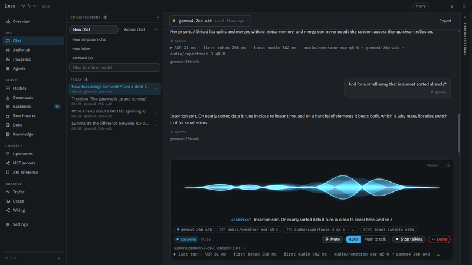</a><br>
      <sub><b>Voice mode</b> · the panel in the composer's place</sub>
    </td>
    <td align="center" width="50%">
      <a href="docs/screenshots/chat-voice-focus.png">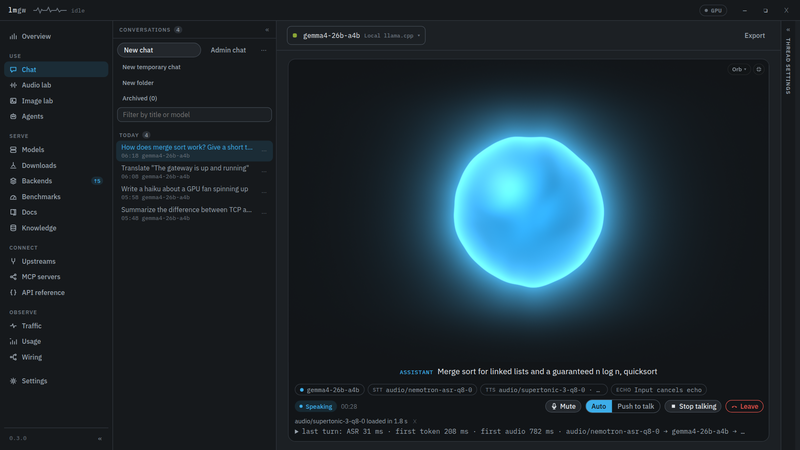</a><br>
      <sub><b>Focus view</b> · the orb while the voice speaks</sub>
    </td>
  </tr>
  <tr>
    <td align="center">
      <a href="docs/screenshots/chat-voice-menu.png">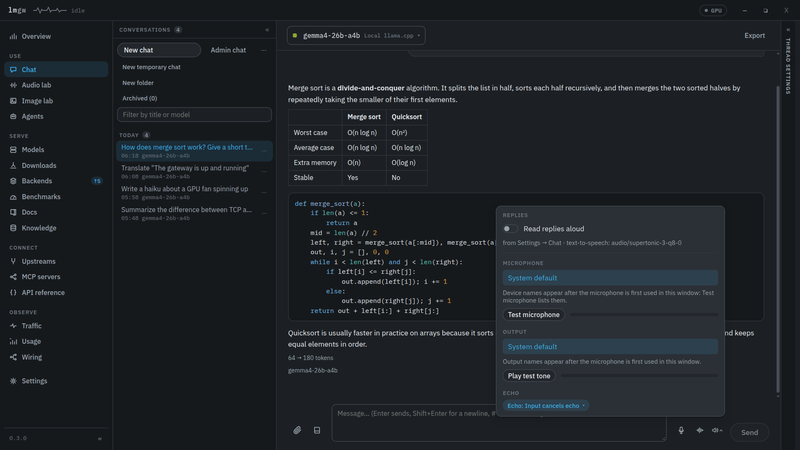</a><br>
      <sub><b>Voice menu</b> · read-aloud and the window's audio devices</sub>
    </td>
    <td align="center">
      <a href="docs/screenshots/settings-chat-voice.png">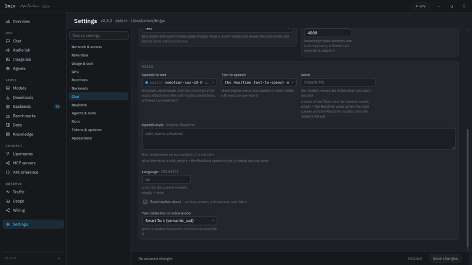</a><br>
      <sub><b>Settings → Chat → Voice</b> · the defaults every thread inherits</sub>
    </td>
  </tr>
</table>

The Chat listens and speaks with your own speech models, through the same
pipeline as `/v1/realtime`. **Settings → Chat → Voice** sets the defaults: the
speech-to-text and text-to-speech models, the voice and its speech style, the
language you speak (what speech recognition hears where the model takes a
language) and the language replies are in (what the model answers in and the
voice pronounces; empty follows the language you speak, so you can speak German
and hear English), with a note where a model cannot take its language, whether replies are read aloud, and how voice
mode hears the end of a turn (Smart Turn, silence, or push-to-talk). An empty model, voice or
style falls back to **Settings → Realtime**, so a configured realtime cascade
serves the Chat as well. A thread overrides any of these in its settings
drawer, and a folder's defaults hand their overrides to the threads created in
it. Nothing loads when a chat opens. The speech-to-text model loads when you
press the microphone, the voice when something is first read, and all three
models when voice mode starts. Each load goes through the same VRAM admission
as a request, so a press may push an idle model out. Under the GPU hold the
controls turn amber and say beforehand which fallback would hear or speak, and
a fallback that answered is named on the message.

- **Dictation.** Click the microphone to start and stop, or hold it, or hold
  **Right Ctrl** anywhere on the page. The transcript lands at the caret for
  editing and nothing is sent before Enter. Esc discards the recording.
- **Read-aloud.** The speaker under a reply reads it. **Read replies aloud**
  in the composer's voice menu reads each new reply as it streams, from its
  first sentence. Code blocks and tables are not read out; the voice says
  "Code block, rust." or "Table." instead.
- **Voice mode.** The waveform button next to the microphone swaps the
  composer for the voice panel. In automatic mode lmgw hears when you start
  and stop, you can talk over the voice to interrupt it, and **Space** stops
  the voice. In push-to-talk mode you hold **Space** (or the Talk button)
  while you speak. **M** mutes and **Esc** leaves. An interrupted reply keeps
  what you heard in the thread's history, and the unheard rest stays greyed
  in the bubble. Captions follow the voice, chips show the chat, speech and
  voice models (a change applies from the next turn), and each spoken reply
  gets a timing line: speech recognition, first token, first audio, and the
  models that served. The visualisation is a ribbon, an orb or a ring, picked
  per window, and the focus view gives the panel the whole column. Turns are
  written into the thread as you speak, so the conversation carries on in
  text whenever you like. Voice mode is not available in Admin Chat threads,
  though dictation and read-aloud are.
- **Models that hear (experimental).** Set **Audio input in voice mode** to
  *local* in Settings → Chat → Voice or in a thread's drawer, and a local
  model lmgw runs that takes audio input (Gemma 4 with its audio projector,
  say) gets each spoken turn as audio while the speech-to-text model
  transcribes it beside. The reply starts at once but plays only when the
  transcript is in: the transcript is what the thread keeps, and a turn that
  turns out to be noise ends quietly. The voice panel's INPUT chip says
  whether the model hears you or reads the transcript, and why. Cloud models
  and servers lmgw does not run never get the audio, and no audio is stored.
- **Audio devices.** The voice menu holds the microphone, the output and the
  echo mode, kept per window. The default expects an input that cancels echo
  itself, such as a USB mic array with echo cancellation or a PipeWire
  echo-cancel source, with lmgw playing on the system default output, so
  you get full duplex with barge-in. Browser echo cancellation, headphones
  and half duplex are the other modes. In the app window the microphone needs
  no prompt, and lmgw moves only its own playback to the chosen output
  through PipeWire (that needs `pipewire-utils`; other programs stay where
  they are). A browser asks for the microphone itself and offers it only in
  a secure context (`localhost` or https, not a LAN address over plain http).
  There the outputs are the browser's own: Chromium plays on the one you
  choose, Firefox only on the system default.

No audio is stored. A spoken turn is kept as text, together with how it was
spoken.

### Network and access defaults

- The gateway listens on **`127.0.0.1:8787`**, loopback only. **Settings → Network & access** changes that after a restart.
- `/v1` and `/mcp` accept requests **without a key** until you turn on **Require gateway API keys on /v1**. Turn it on before you bind to anything but loopback. Keys live under **Usage → Keys & budgets**.
- The dashboard and its `/api` need an owner credential, either a session cookie or an owner key. The tray window signs itself in, and every start logs a login link.

## Documentation

| Document | Covers |
| --- | --- |
| [docs/agents.md](docs/agents.md) | Writing agents: manifests, batch pipelines, container agents |
| [docs/backends.md](docs/backends.md) | Building and pinning engine images for llama.cpp, ik_llama.cpp, audio.cpp and stable-diffusion.cpp |
| [docs/amd-arch.md](docs/amd-arch.md) | Running on Arch Linux with an AMD Ryzen APU |
| [docs/design/](docs/design/) | Design records for each major feature |
| [examples/agents/folder-chat](examples/agents/folder-chat/README.md) | A complete container agent that chats with a folder of documents |

The dashboard's **API reference** page is generated from the running
gateway's own OpenAPI document (`/api/openapi.json`), so it matches the
installed version.

## Development

```sh
(cd crates/lmgw-ui && trunk build)   # dashboard bundle, read from disk by debug builds
scripts/dev-instance.sh               # headless gateway on a scratch data dir, 127.0.0.1:8899
(cd crates/lmgw-ui && trunk watch)    # rebuild the dashboard on change, no restart needed
bash ci/check.sh                      # rustfmt, clippy, the dashboard build and the test suite
bash ci/check.sh --changed            # the fast tier: only what the diff against main touches
```

`ci/check.sh` runs the suite under [cargo-nextest](https://nexte.st) when it is
installed (`cargo install cargo-nextest --locked`): every test in a process of
its own, known flakes retried and named in the summary (`.config/nextest.toml`
says which and why). Without it the script falls back to `cargo test
--workspace` and says so. `--changed [base]` prints what it selected and why:
the touched crates' tests, the `tests/it` modules that `ci/it-map.toml` maps the
diff to, and a smoke set; the dashboard build and the worklet check run only
when their inputs changed. The narrowing needs nextest (without it, `--changed`
runs the whole suite), and the full run stays the check before a merge.

Linking with [mold](https://github.com/rui314/mold) is optional. Rust already
links this target with its bundled rust-lld; mold took 1.2 s instead of 2.0 s
for the `tests/it` binary, a small part of a rebuild. To use it, install
`clang` and `mold` and create an untracked `.cargo/config.toml`:

```toml
[target.x86_64-unknown-linux-gnu]
linker = "clang"
rustflags = ["-C", "link-arg=-fuse-ld=mold"]
```

Keep it out of git with `echo .cargo/config.toml >> .git/info/exclude`. It
covers only the host target, so Trunk's wasm32 build keeps rust-lld, and the
first build after adding or removing it rebuilds everything. Dev builds keep
line tables only (see `Cargo.toml`), so backtraces name every file and line;
for a debugger session, build with `CARGO_PROFILE_DEV_DEBUG=full`.

`scripts/dev-instance.sh` runs a dev instance with its own container names and
a scratch data directory, so your real data stays out of reach. `cargo tauri dev`
starts the full desktop app instead, and a debug build is always a dev run: it
needs `LMGW_DATA_DIR` (a copy from `scripts/dev-copy.sh copy`, or a dir
`scripts/dev-instance.sh` has booted once), refuses the installed app's data
directory and a dir still on the production container prefix, runs beside the
installed app rather than handing over to it, keeps its own webview store in
`<data dir>/webview`, plays its audio as `lmgw-dev`, keeps its tray icon's files
in `<data dir>/tray-icon`, builds its window only on a port it holds, and runs no
updater. There is no switch to point a debug build at your real data.
`scripts/dev-guards-check.sh` checks these refusals under a fake home directory.
A dev copy does not resume the installed app's Hugging Face downloads, and a dev
instance refuses to write into a models directory outside its own data dir:
downloads, retries, deletes and voice-library edits answer `dev_shared_models_dir`,
and an image start skips creating its LoRA and upscaler dirs there. To test those,
point the copy's models dir at a folder inside its data dir. A row's own extra run
args and an agent you re-enable in a copy still reach production's paths.

Your real data dir belongs to the installed app (the RPM; on Arch, the release
build `docs/amd-arch.md` describes). Do not run a work-in-progress build on it:
`cargo run --release` opens `~/.local/share/lmgw` and applies that tree's
database migrations, which are one-way, so an older installed app refuses to
start afterwards.

`scripts/shell-check.py` checks the window's microphone permission and the voice
output routing in the real shell, on a hidden display, with mock microphones and
a private audio graph.

The workspace has six members:

| Crate | Role |
| --- | --- |
| `crates/lmgw-core` | The gateway as a library: API parsers, protocol adapters, routing, container runtime, MCP plane, SQLite store, dashboard API |
| `crates/lmgw-ui` | The dashboard, a Leptos single-page app compiled to WebAssembly |
| `crates/lmgw-api-types` | Types shared by the dashboard and its API |
| `crates/quickdoc-core` | Versioned documentation corpora with hybrid retrieval |
| `src-tauri` | The tray app and window |
| `examples/agents/folder-chat` | Example container agent |

Releases are tagged. `scripts/release.sh 0.4.0` sets the version, commits it
and creates the tag `v0.4.0`, and the tag's message becomes the release notes.
Pushing the tag builds the RPM and publishes the release.
This repository receives one squashed commit per publish: `scripts/publish-github.sh`
copies an audited, scanned tree onto the public tip, and `--tag` puts the release tag on it.

## License

lmgw is source-available under the Functional Source License, version 1.1,
with MIT as its future license ([FSL-1.1-MIT](LICENSE.md)). Anyone can run it,
at home or inside a company, and change and share it. Selling it is the
exception. A commercial product or service that substitutes for lmgw, such as
a rebranded copy or a paid hosted gateway, needs a separate license from its
author until the release it builds on turns two years old, and from then on
that release is plain MIT. The dashboard bundles KaTeX, Mermaid, DOMPurify and
highlight.js, each under its own license, in
[crates/lmgw-ui/assets/vendor](crates/lmgw-ui/assets/vendor/). The gateway
embeds the Silero VAD model (MIT) from
[crates/lmgw-core/assets/realtime](crates/lmgw-core/assets/realtime/) and links
ONNX Runtime (MIT) to run it. Their licences and ONNX Runtime's third-party
notices are in that folder, and the RPM and AppImage install them under
`/usr/share/licenses/lmgw/`.
