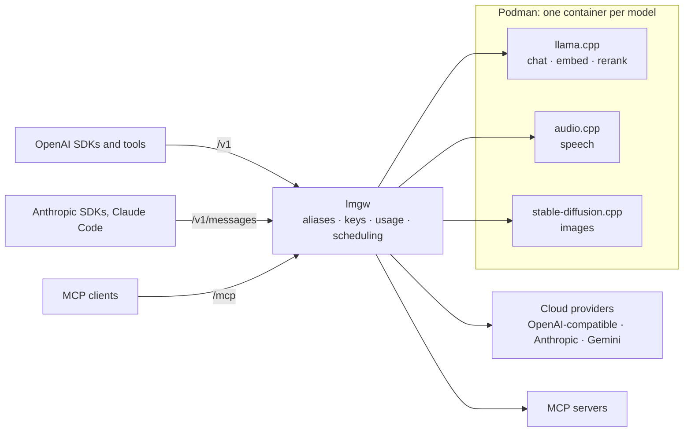

<p align="center">
  <picture>
    <source media="(prefers-color-scheme: dark)" srcset="docs/assets/logo-dark.svg">
    
  </picture>
</p>

<p align="center">
  Your own GPU behind OpenAI- and Anthropic-compatible APIs, with the cloud one alias away.
</p>

<p align="center">
  <a href="https://github.com/lmgw-dev/lmgw/releases/latest"></a>
  <a href="https://github.com/lmgw-dev/lmgw/actions/workflows/ci.yml"></a>
  <a href="LICENSE.md"></a>
  
  
</p>

lmgw, short for local model gateway, is a Linux desktop app. It runs models on
your own GPU and serves them through local copies of the OpenAI and Anthropic
APIs, so tools and SDKs built for those services only need a new base URL. The
models live in Podman containers. llama.cpp handles text, while speech and
images go to audio.cpp and stable-diffusion.cpp, and each container starts
when a request needs it and shares the card under VRAM-aware scheduling. Cloud
providers (OpenAI-compatible, Anthropic, Gemini) plug in behind the same
aliases. Moving an alias from a local model to a cloud one goes unnoticed by
the client, and while the GPU is on hold, requests can fall back to the cloud.
It all runs from the system tray. The dashboard opens in its own window and
works remotely from a browser too.

## Screenshots

<table>
  <tr>
    <td align="center" width="50%">
      <a href="docs/screenshots/overview.png"></a><br>
      <sub><b>Overview</b> · running models and live requests</sub>
    </td>
    <td align="center" width="50%">
      <a href="docs/screenshots/chat.png"></a><br>
      <sub><b>Chat</b> · any alias, with Markdown, math and Mermaid</sub>
    </td>
  </tr>
  <tr>
    <td align="center">
      <a href="docs/screenshots/models.png"></a><br>
      <sub><b>Models</b> · local models, aliases and upstream catalogs</sub>
    </td>
    <td align="center">
      <a href="docs/screenshots/usage.png"></a><br>
      <sub><b>Usage</b> · tokens, latency, throughput and cost</sub>
    </td>
  </tr>
  <tr>
    <td align="center">
      <a href="docs/screenshots/traffic.png"></a><br>
      <sub><b>Traffic</b> · every request, across both API dialects</sub>
    </td>
    <td align="center">
      <a href="docs/screenshots/backends.png"></a><br>
      <sub><b>Backends</b> · engine images built from git</sub>
    </td>
  </tr>
  <tr>
    <td align="center">
      <a href="docs/screenshots/mcp-servers.png"></a><br>
      <sub><b>MCP servers</b> · one <code>/mcp</code> endpoint for all tools</sub>
    </td>
    <td align="center">
      <a href="docs/screenshots/api-reference.png"></a><br>
      <sub><b>API reference</b> · live OpenAPI docs with a request tester</sub>
    </td>
  </tr>
</table>

<sub>The app window at 1920×1080, a 1080p screen at 125% scaling. Click a thumbnail for the full image.</sub>

## Features

**Local models**
- **One container per model.** Chat, embedding and rerank models run on llama.cpp or ik_llama.cpp. audio.cpp covers TTS, ASR and a dozen other audio tasks, and stable-diffusion.cpp generates and edits images.
- **VRAM-aware scheduling.** Admission works from measured GPU memory (NVML, or amdgpu sysfs). A model that doesn't fit waits, or pushes out an idle one, and idle models hand their memory back.
- **From Hugging Face to a running model.** Download a GGUF together with its projector and draft model, and lmgw proposes llama.cpp settings from the file's metadata.
- **Engine builds and benchmarks.** Build engine images from any git ref with pull requests merged in. Benchmarks measure prefill, decode, VRAM and tokens per joule.

**API and routing**
- **Local OpenAI and Anthropic APIs on one port.** `/v1/chat/completions`, `/v1/responses`, `/v1/embeddings`, `/v1/rerank`, `/v1/messages` and more. A client in either dialect can reach any chat model.
- **Local or cloud behind one alias.** An alias points at a local model or at an OpenAI-compatible, Anthropic or Gemini upstream. Streaming, tool calls and reasoning get translated in both directions, so switching changes nothing for the client.
- **Model capabilities in `/v1/models`.** Context length, output limit, modalities and reasoning controls, per model.
- **MCP gateway.** Stdio servers (Podman-isolated by default) and HTTP servers sit behind one `/mcp` endpoint, each under its own tool prefix. For upstreams without `/v1/responses`, lmgw runs that API itself, MCP tool calls included.

**Operations**
- **Usage and cost.** Every request is logged with its tokens, latency and price. Charts break it down by alias and key.
- **API keys with policy.** A key can carry alias and tool scopes, a budget, rate limits and a concurrency cap.
- **GPU hold.** A tray switch pauses local models while you need the card for something else. Requests can fall back to a cloud alias, and the `x-lmgw-fallback` header names the one that answered.

**Dashboard and extensions**
- **Desktop app, remote-ready.** The tray menu covers the GPU hold, starting and stopping models, and updates, and the dashboard opens in a native window. Bind lmgw to your LAN and the same dashboard works remotely in any browser.
- **Chat, plus labs for audio and images.** Chat with any alias, with attachments, knowledge bases and MCP tools. The Audio lab and Image lab are playgrounds for the speech and image routes.
- **Self-administration over MCP.** The `lmgw__*` tools on `/mcp/admin` let an agent such as Claude Code inspect and configure the gateway. They stay off until you enable their key, and start out read-only.
- **Agents.** JSON manifests define chat presets, batch pipelines whose results you review before anything gets written, and container agents that bring their own UI.

## How it works



lmgw parses each request into one internal representation and routes it by
alias, and the target's adapter writes it out again in whatever protocol that
backend speaks. State lives in SQLite. Configuration, request logs and usage
go to `$XDG_DATA_HOME/lmgw`, usually `~/.local/share/lmgw`, unless
`LMGW_DATA_DIR` points elsewhere.

## Requirements

- **Linux, x86_64.** Developed and used daily on Fedora, and packaged as an RPM or an AppImage. There is no macOS or Windows build.
- **Podman** runs local models and stdio MCP servers, and the RPM depends on it. Cloud-only use needs no GPU.
- **NVIDIA GPU** is the tested path. Model containers get the card through `--device nvidia.com/gpu=all --security-opt label=disable` (the default in **Settings → Runtimes**), so you need the driver plus the NVIDIA Container Toolkit. Generate its CDI spec once:
  ```sh
  sudo nvidia-ctk cdi generate --output=/etc/cdi/nvidia.yaml
  ```
- **AMD** works on a Ryzen APU with Vulkan images and a few changed settings, as [docs/amd-arch.md](docs/amd-arch.md) describes. Self-built Vulkan and ROCm images are untested.

## Install

Download the RPM from the [latest release](https://github.com/lmgw-dev/lmgw/releases/latest)
and install it:

```sh
sudo dnf install ./lmgw-*.x86_64.rpm
```

From then on the app checks for new releases in the background and offers to
install them, unless you switch that off under **Settings → Tokens & updates**.
Some releases also carry an AppImage. It's built on current Fedora and needs a
glibc at least that recent. On anything older, build from source.

## Building from source

On Fedora, install the toolchain and the Tauri build dependencies:

```sh
sudo dnf install rust cargo rust-std-static-wasm32-unknown-unknown \
    webkit2gtk4.1-devel gtk3-devel libsoup3-devel librsvg2-devel openssl-devel \
    libayatana-appindicator-gtk3-devel rpm-build gcc gcc-c++ make
export PATH="$HOME/.cargo/bin:$PATH"   # cargo installs land here
cargo install tauri-cli --version '^2.0' --locked
# Trunk builds the dashboard. Take its release binary, since building trunk
# from source fails with GCC 16 (ci/install-build-deps.sh also checks the hash).
curl -fsSL https://github.com/trunk-rs/trunk/releases/download/v0.21.14/trunk-x86_64-unknown-linux-gnu.tar.gz \
    | tar -xz -C ~/.cargo/bin trunk
```

Then build and install the RPM:

```sh
git clone https://github.com/lmgw-dev/lmgw.git && cd lmgw
(cd crates/lmgw-ui && trunk build --release)   # the dashboard, embedded into the binary
cargo tauri build --bundles rpm                 # or --bundles appimage on other distributions
sudo dnf install target/release/bundle/rpm/lmgw-*.rpm
```

Arch Linux notes are in [docs/amd-arch.md](docs/amd-arch.md).

## Quick start

1. Start **lmgw** from the application menu. It lands in the tray, and **Open Dashboard** opens the dashboard with you already signed in.
2. Add a provider under **Upstreams**. For local models, set a models directory under **Settings → Runtimes** first, then download one with **Models → Add from Hugging Face**.
3. Give it an alias under **Models** and call it in either dialect:

```sh
# OpenAI style
curl http://127.0.0.1:8787/v1/chat/completions \
  -H 'content-type: application/json' \
  -d '{"model": "my-model", "messages": [{"role": "user", "content": "Hello!"}]}'

# Anthropic style, same alias
curl http://127.0.0.1:8787/v1/messages \
  -H 'content-type: application/json' -H 'anthropic-version: 2023-06-01' \
  -d '{"model": "my-model", "max_tokens": 512, "messages": [{"role": "user", "content": "Hello!"}]}'
```

Point clients at the gateway. OpenAI SDKs want `http://127.0.0.1:8787/v1` as
their base URL. Anthropic SDKs and Claude Code (`ANTHROPIC_BASE_URL`) want the
bare `http://127.0.0.1:8787`, because they add `/v1/messages` themselves. MCP clients connect to
`http://127.0.0.1:8787/mcp`, for example with
`claude mcp add --transport http lmgw http://127.0.0.1:8787/mcp`.

The self-administration tools live on a separate server at `/mcp/admin`.
Enable the `owner:self-admin` key under **Usage → Keys & budgets**, then send
it as a bearer token (`--header "Authorization: Bearer <key>"`). Two dashboard
pages help here. **Wiring** traces each local chat model from
its download to the name it's served under, and **API reference** documents
the gateway's HTTP API.

### Remote use from a browser

The window is optional. lmgw serves the dashboard itself, and on the same
machine the tray's **Open in Browser** opens it already signed in. Remote
access takes three changes. Set the bind address to `0.0.0.0:<port>` under
**Settings → Network & access**, restart the gateway from the tray, and turn on
**Require gateway API keys on /v1** so the API isn't open to your whole
network. Then open `http://<host>:<port>/` in any browser on your LAN and sign
in with the `owner:dashboard` key, copied from **Usage → Keys & budgets**.

### Network and access defaults

- The gateway listens on **`127.0.0.1:8787`**, loopback only. **Settings → Network & access** changes that after a restart.
- `/v1` and `/mcp` accept requests **without a key** until you turn on **Require gateway API keys on /v1**. Turn it on before you bind to anything but loopback. Keys live under **Usage → Keys & budgets**.
- The dashboard and its `/api` need an owner credential, either a session cookie or an owner key. The tray window signs itself in, and every start logs a login link.

## Documentation

| Document | Covers |
| --- | --- |
| [docs/agents.md](docs/agents.md) | Writing agents: manifests, batch pipelines, container agents |
| [docs/backends.md](docs/backends.md) | Building and pinning engine images for llama.cpp, ik_llama.cpp, audio.cpp and stable-diffusion.cpp |
| [docs/amd-arch.md](docs/amd-arch.md) | Running on Arch Linux with an AMD Ryzen APU |
| [docs/design/](docs/design/) | Design records for each major feature |
| [examples/agents/folder-chat](examples/agents/folder-chat/README.md) | A complete container agent that chats with a folder of documents |

The dashboard's **API reference** page is generated from the running
gateway's own OpenAPI document (`/api/openapi.json`), so it matches the
installed version.

## Development

```sh
(cd crates/lmgw-ui && trunk build)   # dashboard bundle, read from disk by debug builds
scripts/dev-instance.sh               # headless gateway on a scratch data dir, 127.0.0.1:8899
(cd crates/lmgw-ui && trunk watch)    # rebuild the dashboard on change, no restart needed
bash ci/check.sh                      # rustfmt, clippy (advisory) and the test suite
```

`scripts/dev-instance.sh` runs a dev instance with its own container names and
a scratch data directory, so your real data stays out of reach. `cargo tauri dev`
starts the full desktop app instead. That one uses your real data directory
and counts as the same app as an installed lmgw, so quit the installed one
first.

The workspace has six members:

| Crate | Role |
| --- | --- |
| `crates/lmgw-core` | The gateway as a library: API parsers, protocol adapters, routing, container runtime, MCP plane, SQLite store, dashboard API |
| `crates/lmgw-ui` | The dashboard, a Leptos single-page app compiled to WebAssembly |
| `crates/lmgw-api-types` | Types shared by the dashboard and its API |
| `crates/quickdoc-core` | Versioned documentation corpora with hybrid retrieval |
| `src-tauri` | The tray app and window |
| `examples/agents/folder-chat` | Example container agent |

Releases are tagged. `scripts/release.sh 0.4.0` sets the version, commits it
and creates the tag `v0.4.0`, and the tag's message becomes the release notes.
Pushing the tag builds the RPM and publishes the release.

## License

lmgw is source-available under the Functional Source License, version 1.1,
with MIT as its future license ([FSL-1.1-MIT](LICENSE.md)). Anyone can run it,
at home or inside a company, and change and share it. Selling it is the
exception. A commercial product or service that substitutes for lmgw, such as
a rebranded copy or a paid hosted gateway, needs a separate license from its
author until the release it builds on turns two years old, and from then on
that release is plain MIT. The dashboard bundles KaTeX, Mermaid, DOMPurify and
highlight.js, each under its own license, in
[crates/lmgw-ui/assets/vendor](crates/lmgw-ui/assets/vendor/).
